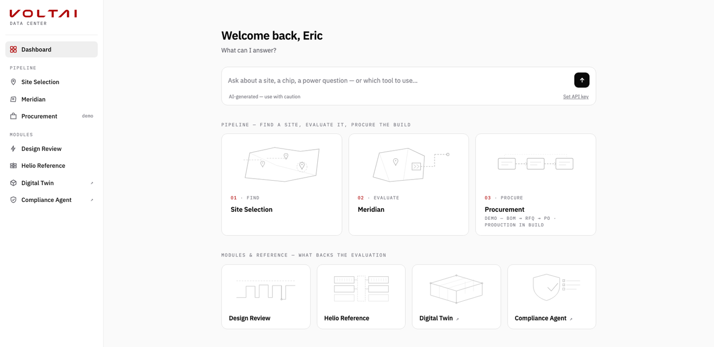
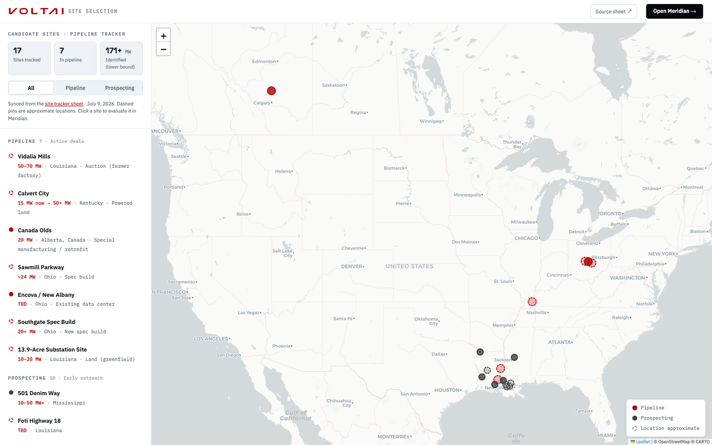
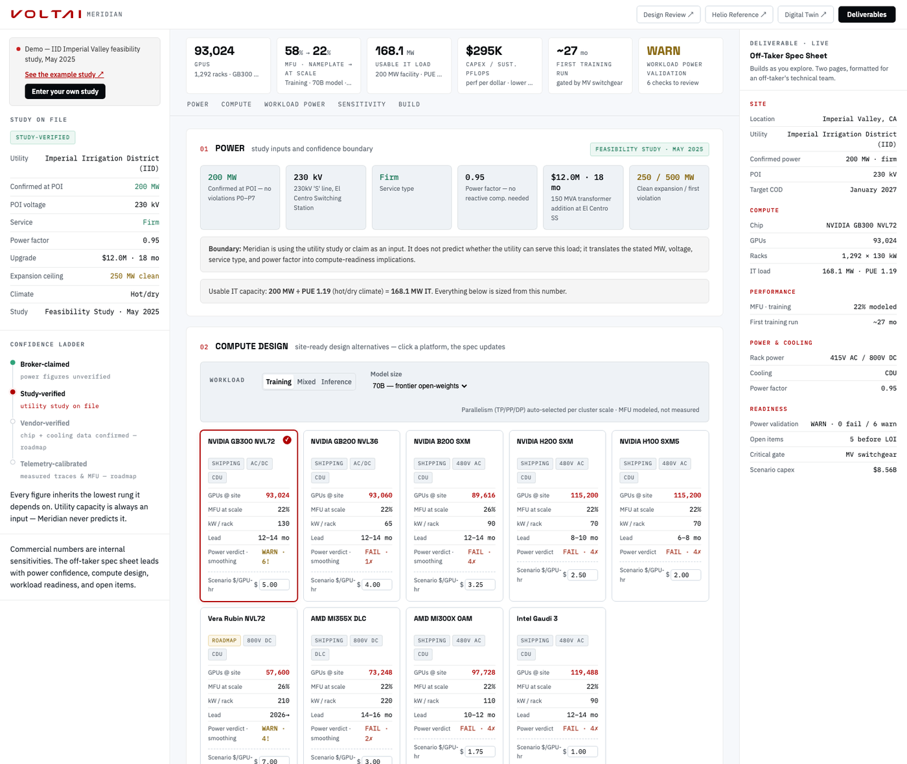
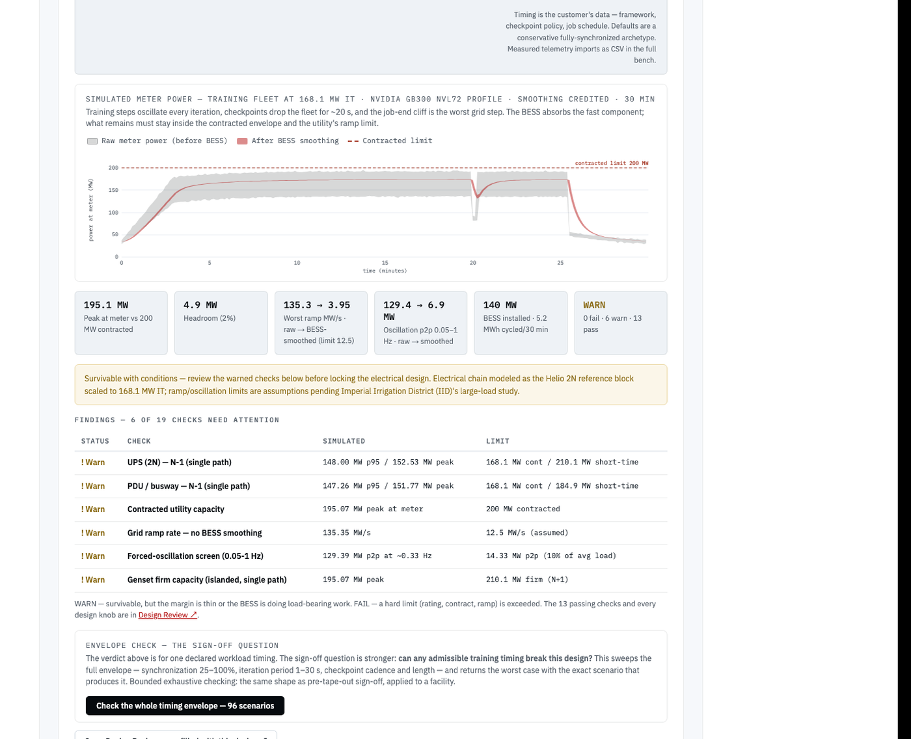
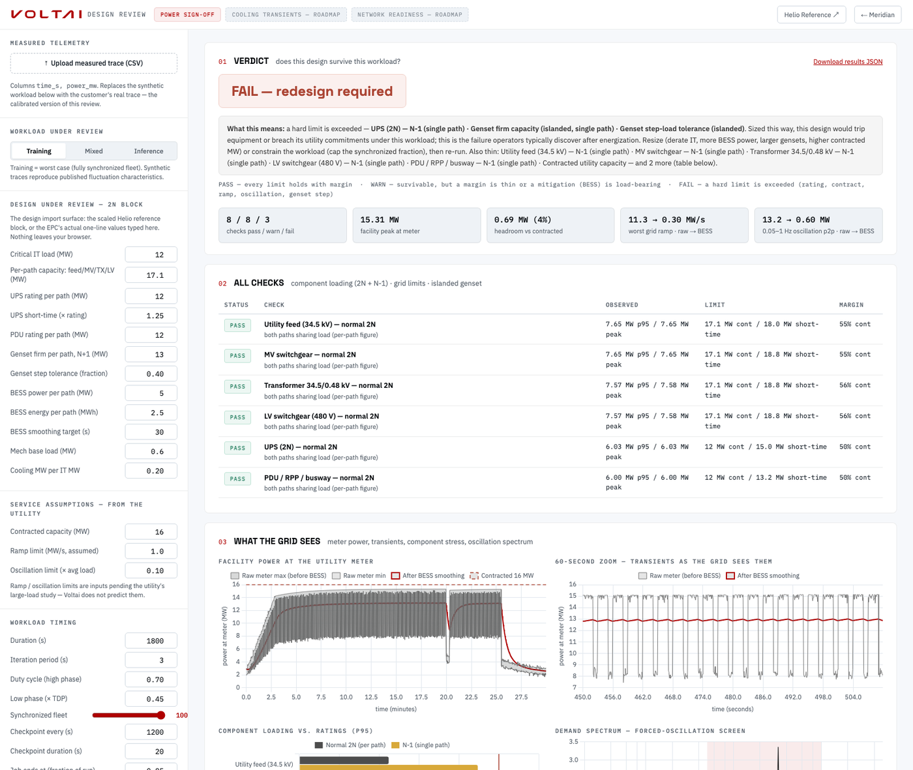
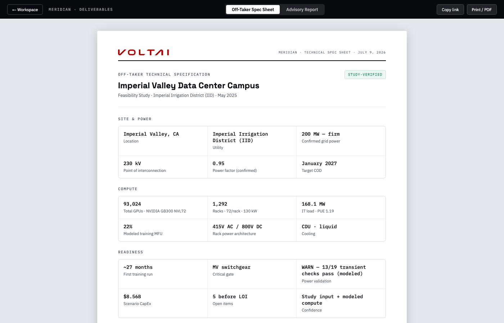
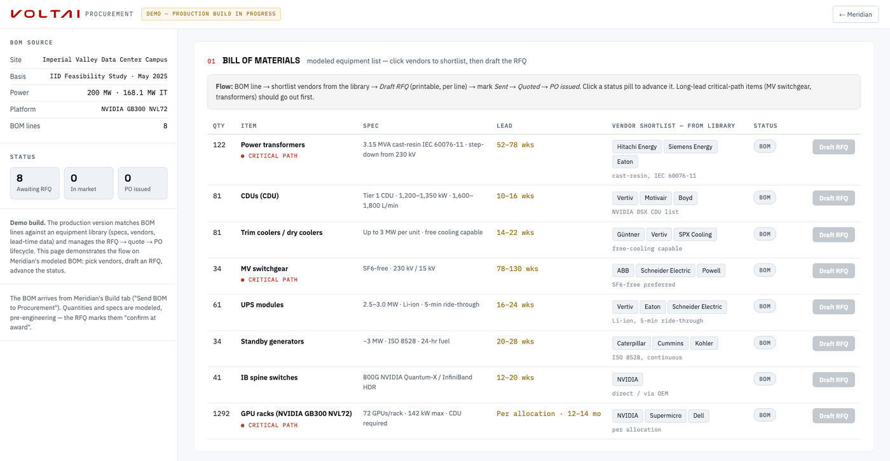

# The Full Product Picture — Pipeline, Roles, and the Design Loop

**One page for anyone confused about what we author vs. what we review. July 2026.**

The one-liner: **VoltAI doesn't design boards or buildings — it verifies them.** The DC toolkit
extends the schematic-review posture from PCB (arcturus: part intelligence → schematic review)
one level up: site, facility, workload.

---

## The pipeline, and who holds the pen

| Step | Tool | We author | Someone else authors | Artifact out |
|------|------|-----------|---------------------|--------------|
| 01 Find | Site Selection | the tracker/map | brokers/EDAs supply sites, utilities supply studies | candidate site + its power claim |
| 02 Evaluate | **Meridian** | the evaluation: IT load, chip/rack design alternatives, workload power verdict, envelope check | the utility study (always an input, never predicted) | **off-taker spec sheet** + **BOM** + open items |
| — Design | (external) | *nothing* — we hand over a basis of design and review what comes back | **EPC / MEP firm** authors the real one-line, equipment sizing, MEP | their electrical design |
| — Review | Workload Power (module) | the verdict: their design vs. the workload envelope — 19 checks + envelope sweep | — | pass/warn/fail, counterexamples |
| 03 Procure | Procurement (teammate) | RFQ/PO workflow on library data | vendors quote | POs |

Helio is not a step — it's the **reference architecture** (basis of design) that makes step 02
possible before any real design exists, and the template the RFQ quantities derive from.

---

## The walkthrough — demo script, with where we play at each step

Everything below is live at the deployed site; each step hands its output to the next.

### 0 · Dashboard — the story in one screen



Open on the pipeline: *find a site, evaluate it, procure the build* — with the review modules
underneath. One sentence: **"VoltAI doesn't design boards or buildings — it verifies them.
This is the schematic-review posture, one level up."**

### 1 · Site Selection — where deals come from *(we play: the tracker + screen)*



The live deal pipeline from the team's tracker sheet — 17 sites, red = active pipeline,
grey = prospecting, dashed = location approximate. The talking point is the utility reality:
every one of these needs a ~$50K non-refundable study per load scenario, so *choosing which
sites are worth the study, and at what MW to file,* is the first paid question. Click a site →
**Evaluate in Meridian** (MW, location, utility, climate carry over).

### 2 · Meridian — the evaluation *(we play: the whole surface)*



Utility study in (left rail, with the confidence ladder making the verification level
unavoidable) → compute readiness out: usable IT MW, chip/rack design alternatives with
per-chip **power verdicts**, MFU at scale, the inference Pareto. The chip cards are design
alternatives, not chip shopping — the question on screen is *"what AI infrastructure promise
can this site credibly support?"*

### 3 · Workload Power — the demand-side model *(we play: the thing nobody else has)*



The simulated meter trace of a synchronized AI fleet — training oscillation, checkpoint dips,
the job-end cliff — against the contracted envelope. Findings only at this level (full evidence
lives in Design Review). The **envelope check** is the differentiator sentence: *"not just
'does this workload pass' — can ANY admissible workload break this design?"* That's the
pre-tape-out sign-off shape applied to a facility.

### 4 · Design Review — the review agent *(we play: review, never authoring)*



The deep-dive bench. Left rail = the design import surface: today the Helio-scaled block or
the EPC's actual one-line values typed in; measured telemetry uploads as CSV (the calibrated
version). Verdict in plain language — WARN = thin margin or the BESS doing load-bearing work,
FAIL = a named hard limit exceeded. Power sign-off is the first review dimension; cooling
transients and network readiness are visible roadmap tabs.

### 5 · Deliverables — what the customer holds



The two-page off-taker spec sheet (technical readiness, no NPV/IRR hero metrics) and the
internal advisory report. Every figure carries its confidence level; share links reproduce
exact state.

### 6 · Procurement — the handoff *(teammate's build; we play: the BOM seam)*



Meridian's Build tab sends the modeled BOM here; lines match against the equipment library,
RFQs draft per line, status tracks BOM → RFQ → quoted → PO. Demo today — the production,
library-data-backed version is in build. The seam is the point: evaluation ends at a
structured BOM, procurement owns the market.

---

## The boundary (what we model, what we never claim)

**Inputs we accept:** confirmed/claimed site power (MW, voltage, service type, PF, upgrades,
timeline), site context (climate, grid operator), target workload (train/infer/mix, model
size, batch, timing), candidate platform, optional engineering data (power quality, CDU
curves, measured traces).

**We model:** usable IT after PUE/climate; rack/GPU count per platform; cooling + rack-power
architecture fit; DSX-style readiness checks; modeled MFU and inference trade-offs; equipment
BOM, lead times, critical path; workload-driven electrical transients and the envelope check;
the spec sheet and advisory report.

**We never claim to model:** utility capacity or interconnection availability, queue position,
substation/interconnection design, construction-ready MEP, investment-grade underwriting,
off-taker demand or credit. Utility capacity is always an input — the confidence ladder exists
to keep that honest.

## Open questions still live for the team

1. Primary buyer: developer, off-taker, financier, engineering firm, or Voltai internal BD?
2. First paid deliverable: tech pack, owner-rep package, or internal site-screening report?
3. Should the off-taker spec sheet include financials at all? (Current answer: no — internal
   advisory report only.)
4. Easiest first proof point to validate: MFU, cooling transients, or power transients?
5. Non-NVIDIA platforms: support explicitly, or lead with NVIDIA/DSX credibility?

---

## The design loop — why it looks circular and isn't

The confusion: *"Meridian outputs a design spec to the engineering firm, but then we also
evaluate their design — aren't we grading our own homework?"* No, because the spec and the
design are different documents, and the thing that connects them is the **workload envelope**:

```
            (1) SPEC OUT                        (2) DESIGN BACK
 Meridian ──────────────────► EPC/MEP firm ──────────────────► Workload Power
  "the site supports X racks    authors the real                reviews THEIR design
   of chip Y; here is the       one-line, sized                 against the SAME envelope
   workload power envelope      equipment, MEP                  we specified in (1):
   your design must survive:                                    19 checks + the timing
   ramps, oscillation,                                          envelope sweep
   checkpoint cliffs, BESS                                      → PASS / WARN / FAIL
   duty"                                                          + counterexample
```

- **The spec is requirements, not a design.** IT MW, chip platform, rack count, cooling class,
  power quality constraints, and — the part nobody else specifies — the *workload power
  envelope* (how a synchronized AI fleet actually pulls power).
- **The design is their answer.** We never draw it.
- **The review checks their answer against the envelope we specified.** Same engine, different
  input source. Before their design exists, Meridian runs the identical checks against the
  *Helio template scaled to the site* — that's a feasibility screen ("would a standard design
  survive this workload?"). After their design exists, the same bench runs against *their
  numbers* — that's design review ("does YOUR design survive it?"). Two moments, one engine.

**Where their design enters today:** `power-signoff.html` already exposes every design
parameter — utility feed, MV switchgear, transformer, LV, UPS, PDU ratings, genset firm MW and
step tolerance, BESS power/energy, contracted MW, ramp limit. An EE can sit down and type their
one-line into it now. File-level ingestion (parse their ETAP/SKM export or equipment schedule —
the `syscap` analog, where the PCB product ingests the customer's real `.sdax`) is the later,
heavier version of the same thing. Manual entry is not a gap in the story; it's v1 of the
import surface.

**Rack level is not part of their design review.** Rack power architecture is fixed per
platform (NVIDIA DSX: 415V AC / 800V DC, CDU class) — it's *demand-side data from the chip
database*, not something the EPC designs. The review surface is everything upstream of the
rack: switchgear, transformers, UPS, gensets, BESS, and the utility contract. The rack tells
us how the load behaves; their design tells us whether the building survives it.

---

## The wedge, and the honest barrier

The July 2026 EE conversations ([Mark Tuckwell, July 9 — notes](https://notes.granola.ai/t/3483f43c-b5a4-4366-be48-7aeebade741e-008umkv4)) are the evidence for both:

- **The wedge is the knowledge gap.** Facility EEs don't know AI workload behavior
  (synchronized training transients, checkpoint cliffs, on-board smoothing); AI/compute people
  don't know facility power. Nobody in the room owns the translation. That translation *is*
  Meridian.
- **The barrier is credibility, not features.** Our workload traces are synthesized, MFU is
  heuristic, smoothing parameters are pending EE review (see `TEAM_BRIEF_POWER_MODEL.md`).
  An EE's first question is "where did this curve come from?" — which is why every surface
  says *modeled, not measured*, why the confidence ladder exists (broker-claimed →
  study-verified → vendor-verified → telemetry-calibrated), and why the calibration asks
  (chip power data, Vertiv transient curves) are the real unlock, not more UI.

Corollary: don't oversell the verdict to EEs. Sell the *envelope question* ("can any admissible
workload break this design?") — that's the question they can't currently answer, and the one
the formal-methods lineage lets us own.

---

## What "design partner" means, and when to build more

A **design partner** = one external party (developer, owner's rep, EPC, or off-taker) who
agrees to run a *real deal* through the toolkit and give us their actual documents — a real
utility study in, a real design back for review. Not a customer yet; a source of truth.

Gates for further engineering (in order, each triggered by pull, not by roadmap):

1. **Now (no partner needed):** demo coherence — shipped. Pipeline pages, deliverables, BOM
   handoff. Slides can be written from what's deployed.
2. **First partner:** utility-study PDF extraction into Meridian's rail (one session of work);
   RFQ handoff hardening with the procurement build.
3. **Partner's design in hand:** file-level design import for the review bench (syscap
   analog) — only worth building against a real artifact someone gives us.
4. **Recurring use:** port into the arcturus platform (auth, persistence, multi-user) —
  days of work, but pointless before 2–3 exist.

Everything else in the earlier roadmap docs (telemetry calibration, network simulation, SMT
sign-off) hangs off the same principle: build when a partner's artifact demands it.

---

## "If review comes after the EPC, what's our edge?"

Two answers, one precedent:

1. **Being the reviewer is the business.** Schematic review — the company's main product — is
   also "after the designer." Downstream in time is not downstream in value: the reviewer owns
   the acceptance criteria. Whoever defines *what the design must survive* sits commercially
   upstream of whoever draws it.
2. **The review engine runs at every stage, with progressively better inputs.** Assumption-based
   screen before any study → study-verified evaluation → design sign-off after the EPC. It's
   one engine fed better data over the deal's life, not a late-stage checkpoint. The constant
   across all three is the thing nobody else has: **the demand-side model** — how an AI fleet
   actually pulls power. EPCs size to nameplate and code; utilities ask "what does your load
   do?"; developers can't answer. That translation is the product at every stage.

## The utility constraint is the use case, not the objection

What the Entergy conversations (July 2026) established: a $50K non-refundable study per site
*per load scenario*, valid ~60 days; anything above 15–20 MW means a customer-owned substation
at 36–48 months; Mississippi mandates interruptible service for data centers; transformers are
a 3–4 year lead. The utility process — not land, capital, or equipment — gates every site in
the pipeline.

That is the strongest argument *for* the toolkit, in three specific places:

- **Before the study:** which sites are worth $50K and a 60-day window, and at what MW should
  we file? (Site Selection + Meridian's assumption-based screen — the "pre-power-study
  briefing" workflow.)
- **Into the study:** large-load studies ask the developer to characterize the load. An AI
  training fleet's synchronized transients are exactly what nobody can characterize — our
  envelope and traces are that characterization.
- **After interruptible service:** where curtailment is mandatory, backup/BESS sizing against
  the *real* workload shape is the difference between a survivable design and a stranded one —
  which is precisely what Workload Power checks.

Business model follows the two levels: **assumption-based = cheap, high-volume screening**
(top of funnel, protects the $50K decisions); **verification = per-deal diligence artifacts**
(spec sheet, load characterization, design sign-off) priced against decisions with 10–15-year
ESA minimum-bill clauses attached. Small fee, huge decision — the same asymmetry the PCB
review product sells.

## Roadmap shape — same curve as arcturus

Arcturus went **knowledge agent → schematic review agent → (now) schematic generation**. The DC
toolkit is walking the identical curve, one stage behind:

| Arcturus stage | DC analog | Status |
|----------------|-----------|--------|
| Knowledge agent | Site/study/equipment knowledge: Site Selection, study parsing, procurement library | demos shipped; parsing later |
| Review agent | Workload power sign-off (19 checks + envelope) | v1 shipped; calibration = credibility |
| Generation | Demand side: workload optimizer under a fixed MW envelope (the EE-proposed direction — Meridian verifies, the optimizer generates). Supply side, later: auto-instantiated basis-of-design from Helio | not started — correctly |

Generation comes last on purpose, exactly as it did for boards: you earn the right to generate
by being trusted to review.
